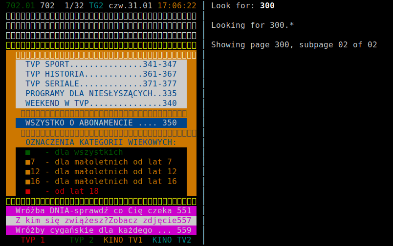

Overview
========

**dochttx** is a simple text-mode teletext browser.

Only analog TV is supported at the moment.

.. <git> (don't include in release tarballs)

Example
-------

.. </git>

Prerequisites
=============

* GNU make
* pkg-config_
* ncurses_ with wide-character support, i.e. ``libncursesw``
* ZVBI_

.. _pkg-config:
   https://www.freedesktop.org/wiki/Software/pkg-config/
.. _ncurses:
   https://invisible-island.net/ncurses/
.. _ZVBI:
   http://zapping.sourceforge.net/ZVBI/

.. vim:ft=rst ts=3 sts=3 sw=3 et
